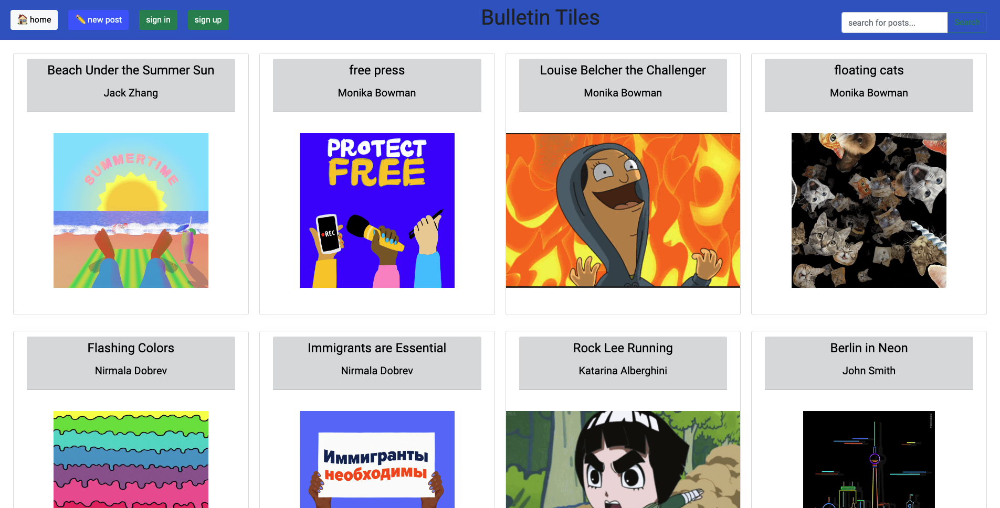

<!--
*** Thanks for checking out the Best-README-Template. If you have a suggestion
*** that would make this better, please fork the repo and create a pull request
*** or simply open an issue with the tag "enhancement".
*** Don't forget to give the project a star!
*** Thanks again! Now go create something AMAZING! :D
-->

<!-- PROJECT SHIELDS -->
<!--
*** I'm using markdown "reference style" links for readability.
*** Reference links are enclosed in brackets [ ] instead of parentheses ( ).
*** See the bottom of this document for the declaration of the reference variables
*** for contributors-url, forks-url, etc. This is an optional, concise syntax you may use.
*** https://www.markdownguide.org/basic-syntax/#reference-style-links
-->
<!-- [![Contributors][contributors-shield]][contributors-url]
[![Forks][forks-shield]][forks-url]
[![Stargazers][stars-shield]][stars-url]
[![Issues][issues-shield]][issues-url]
[![MIT License][license-shield]][license-url]
[![LinkedIn][linkedin-shield]][linkedin-url] -->

<!-- PROJECT LOGO -->
 

  

  <a href="https://bulletintiles.onrender.com/"><h1 align="center">Bulletin Tiles</h1></a>

  

    A bulletin board to share your content with the world!
  

<!-- ABOUT THE PROJECT -->
## About The Project

Bulletin Tiles is a web application that allows people to share posts and view other people's posts. A user may login and share content that can be viewed by anyone who visits the website. 

(<a href="#top">back to top</a>)

### Built With
* 
* 
* [![React][React.js]][React-url]
* 
* 
* [![Bootstrap][Bootstrap.com]][Bootstrap-url]
* 
* 

(<a href="#top">back to top</a>)

<!-- CONTACT -->
## Contact

Jiahui (Jack) Zhang - jiahui.zhang.20@gmail.com

Project Link: [https://github.com/Jiahui-Zhang-20/bulletintiles](https://github.com/Jiahui-Zhang-20/bulletintiles)

(<a href="#top">back to top</a>)

<!-- MARKDOWN LINKS & IMAGES -->
<!-- https://www.markdownguide.org/basic-syntax/#reference-style-links -->
[React.js]: https://img.shields.io/badge/React-20232A?style=for-the-badge&logo=react&logoColor=61DAFB
[React-url]: https://reactjs.org/
[Bootstrap.com]: https://img.shields.io/badge/Bootstrap-563D7C?style=for-the-badge&logo=bootstrap&logoColor=white
[Bootstrap-url]: https://getbootstrap.com
